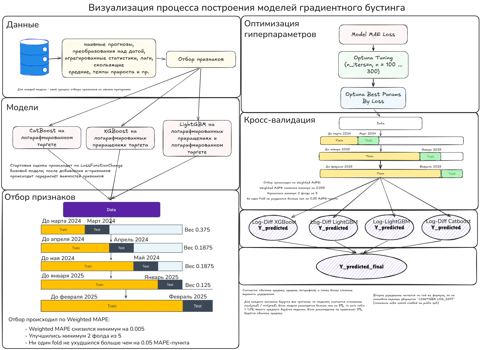

#### Техническая сторона решения

Процесс отбора признаков здесь достаточно непримечателен, хотя, в двух словах отметить стоит. Для исходного признакового набора генерируется порядка 380 фичей (скользящие окна, лаги, агрегаты и пр.). Далее проводится своего рода кастомный Forward Selection с нуля - считаем важность по лоссу базовой модели (например, CatBoost глубиной 5) для всего признакового пространства, а после итеративно отбираем по одной фиче из отсортированного по важности по вкладу в лосс в пул выбранных фичей. Каждые несколько фичей важность исходного набора (уже из оставшихся признаков) пересчитывается и процесс отбора сверху вниз запускается заново (страховка против дублирования сигналов / учёт перекрестных значимостей). Само значение вклада в лосс считается усреднением между 5 различными фолдами-месяцами в данных с различными весами.

Процесс подбора гиперпараметров аналогично проводился по взвешенному значению метрики на валидации, но уже на 3-х фолдах (использовалась Optuna, метод - multivariate TPE).

Но более интересна здесь всё же сама модель.

Подсвечу, что отбор признаков происходил для разных моделей вида градиентного бустинга (под разными имею в виду обучение на разных таргетах - логарифм розничного товарооборота и лог-дифференцированное значение розничного товарооборота). Соответственно, признаки были отобраны несколько разные для каждого из бустингов (с некоторыми пересечениями).

После получения прогнозов на тестовых данных значения прогнозов усреднялись 4-мя различными методами усреднения, а после ещё раз усреднялись простым арифметическим средним для итогового предикта.

В общем, фактически, был реализован частный случай стекинга - блендинг с некоторой добавленной стохастичностью. Почему это работает?

Вспомним, что чем менее скоррелированы между собой ошибки базовых алгоритмов, тем сильнее мы снизим дисперсию итогового прогноза:

$$
E_N =
E_1
\left(
\rho + \frac{1-\rho}{N}
\right).
$$

Математическое ожидание ошибки композиции (ансамбля) из N моделей = Математическое ожидание ошибки одной из моделей * (коэф. корреляции + (1 - коэф. корреляции) / N), где коэффициент корреляции ответственен за корреляцию между ошибками базовых моделей.

В задаче, справедливости ради, прогнозы были достаточно схожими (то есть, высокая корреляция перебивала полезный эффект от N моделей), поэтому эффект не был откровенно большим, но так или иначе среднее сглаживало перепрогнозы и недопрогнозы отдельных моделей.

Сама формула, скорее, схематично показывает причину улучшения итогового скора на лидерборде, так как, подозреваю, при ансамблировании ансамблей она становится заметно сложнее (но является таковой в обычном бэггинге).

Может ли быть оптимальное число моделей в таком ансамбле? Обратимся к комбинаторной теории переобучения:

- Если у нас есть хорошая модель, а остальные - плохие, то хорошая модель будет превалировать и мы не будем переобучаться;
- Если есть много похожих друг на друга хороших моделей, мы тоже не будем переобучаться, так как эффективная сложность совокупности похожих друг на друга моделей невелика;
- Но если получится так, что модели существенно различные и все примерно одинаково плохие, то переобучение будет очень сильным, а сам эффект переобучения растет по мере роста числа моделей (Константин Воронцов).

Отсюда заметим, что, в целом, если все модели достаточно хорошие, имеет смысл увеличивать их количество; тем не менее, на практике достаточно понять на валидации оптимальное минимальное число.

Прикрепляю схему алгоритма. Так немного проще визуально понять, что происходит.

Немного переписанное пояснение Радослава Нейчева ([ссылка на лекцию](https://www.youtube.com/live/rBIVch1h5qc?si=riKnrX82OtWvCLR6)) (чуть подробнее расписал):

##### Bootstrap and variance reduction

- Consider dataset $X$ containing $m$ objects.
- Pick $m$ objects with replacement from $X$ and repeat this procedure $N$ times to get $N$ bootstrap datasets:
$$
X_1, X_2, \ldots, X_N.
$$
- Error of the model trained on $X_j$:
$$
\varepsilon_j(x) = b_j(x) - y(x), \quad j = 1, \ldots, N.
$$
Then:
$$
\mathbb{E}_x [b_j(x) - y(x)]^2 = \mathbb{E}_x \varepsilon_j^2(x).
$$
- The mean error of $N$ separate models:
$$
E_1 = \frac{1}{N} \sum_{j=1}^{N} \mathbb{E}_x \varepsilon_j^2(x).
$$
Assume for simplicity that all base models have the same error variance:
$$
\mathbb{E}_x[\varepsilon_j^2(x)] = \sigma^2.
$$
Then:
$$
E_1 = \sigma^2.
$$
##### Naive assumption

If we assume that the errors are unbiased and uncorrelated:
$$
\mathbb{E}_x[\varepsilon_j(x)] = 0,
$$
$$
\mathbb{E}_x[\varepsilon_i(x)\varepsilon_j(x)] = 0, \quad i \ne j,
$$
then the ensemble error decreases by $N$ times.

But this assumption is usually too strong.
##### More realistic assumption: correlated errors

In practice, errors of base models are not fully independent.

Let the average pairwise correlation between errors be:
$$
\operatorname{corr}(\varepsilon_i, \varepsilon_j) = \rho, \quad i \ne j.
$$
Since:
$$
\operatorname{corr}(\varepsilon_i, \varepsilon_j)
=
\frac{
\mathbb{E}_x[\varepsilon_i(x)\varepsilon_j(x)]
}{
\sigma^2
},
$$
we get:
$$
\mathbb{E}_x[\varepsilon_i(x)\varepsilon_j(x)] = \rho \sigma^2, \quad i \ne j.
$$

This is exactly the place where the correlation coefficient appears.
##### Averaged model

The final model averages all predictions:
$$
a(x) = \frac{1}{N} \sum_{j=1}^{N} b_j(x).
$$
Its error is:
$$
E_N =
\mathbb{E}_x
\left(
\frac{1}{N} \sum_{j=1}^{N} b_j(x) - y(x)
\right)^2.
$$
Since:
$$
b_j(x) - y(x) = \varepsilon_j(x),
$$
we have:
$$
E_N =
\mathbb{E}_x
\left(
\frac{1}{N} \sum_{j=1}^{N} \varepsilon_j(x)
\right)^2.
$$
Expanding the square:
$$
E_N =
\frac{1}{N^2}
\mathbb{E}_x
\left(
\sum_{j=1}^{N} \varepsilon_j^2(x)
+
\sum_{i \ne j} \varepsilon_i(x)\varepsilon_j(x)
\right).
$$
Now substitute:
$$
\mathbb{E}_x[\varepsilon_j^2(x)] = \sigma^2,
$$
and
$$
\mathbb{E}_x[\varepsilon_i(x)\varepsilon_j(x)] = \rho \sigma^2, \quad i \ne j.
$$
Then:
$$
E_N =
\frac{1}{N^2}
\left(
N\sigma^2
+
N(N-1)\rho\sigma^2
\right).
$$
Simplify:
$$
E_N =
\sigma^2
\left(
\frac{1}{N}
+
\frac{N-1}{N}\rho
\right).
$$
Equivalently:
$$
E_N =
\sigma^2
\left(
\rho + \frac{1-\rho}{N}
\right).
$$
Since:
$$
E_1 = \sigma^2,
$$
we get:
$$
E_N =
E_1
\left(
\rho + \frac{1-\rho}{N}
\right).
$$
##### Interpretation

If $\rho = 0$, then base model errors are uncorrelated:
$$
E_N = \frac{E_1}{N}.
$$
This is the ideal case.

If $\rho = 1$, then all errors are perfectly correlated:
$$
E_N = E_1.
$$
In this case, averaging gives no improvement.

If $0 < \rho < 1$, then the ensemble still reduces error, but not by $N$ times:
$$
E_N =
E_1
\left(
\rho + \frac{1-\rho}{N}
\right).
$$
Therefore, the smaller the correlation $\rho$ between base models, the stronger the variance reduction.
